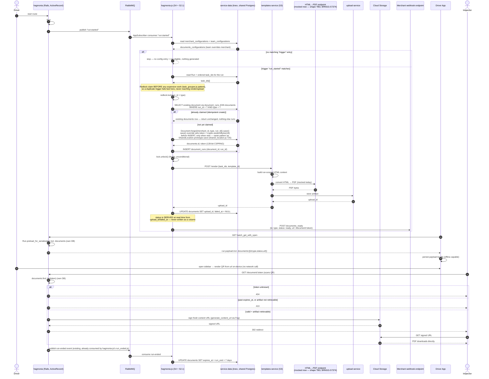
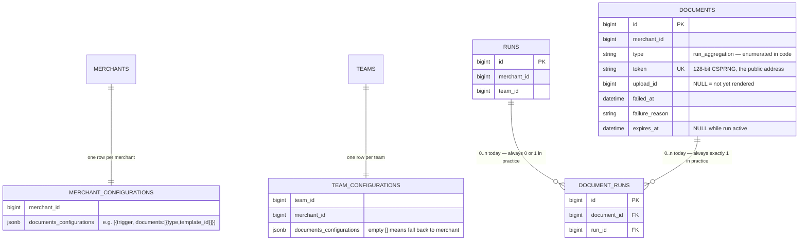

# BRNGG-55375 — Driver App QR Code for DeCA Compliance Documents

**Epic:** [BRNGG-55375](https://bringg.atlassian.net/browse/BRNGG-55375) — Spain Sustainable Mobility Law 9/2025, DeCA must be digital + scannable from 5 Oct 2026.
**Purpose of this doc:** consolidate the epic + 13 stories into the 6 levels you described, filter out what's dead/irrelevant, and — the part you asked for — verify the tickets' design claims against the actual code in `upload-service`, `templates-service`, `hagmonia`, `hagmonia-js`, since a lot of the "grilling" happened in prose and needs to be checked against reality.

Status sections in the source tickets are ignored throughout, per your instruction — this is about the design, not who's doing what by when.

---

## E2E sequence diagram

Everything below §0 in prose, in one flow — the trigger, the eligibility gate, the write path split (hagmonia-js writes, hagmonia reads), the mocked render, the webhook, the driver-app offline path, the roadside scan with its 404/410/302 branching, and retention set at run end.



Corrections from the first draft, and why:

1. **PDF conversion is its own step now, explicitly mocked.** You flagged that "mocked" will soon become a real HTML→PDF endpoint call (BRNGG-57374). Drawn as a distinct `PdfConv` participant templates-service calls out to, rather than folded into templates-service itself — so swapping the mock for the real Gotenberg-backed endpoint later is a one-box change, not a re-draw.
2. **Why claim the `documents` row before rendering, not after:** claim-then-work is the standard idempotent-job pattern. The cheap, contended step (insert + advisory lock) has to happen *before* the expensive, side-effecting one (render + upload) — otherwise two concurrent triggers for the same run both render and upload before either discovers it's a duplicate, wasting work and racing over which upload wins. Claiming first means a duplicate fails fast at the cheap step and never touches templates-service. This also matches how S2/S3 already split ownership in the tickets: mint the row + token first (S2), render into it second (S3), flip it to ready last (S2) — not new, just drawn out.
3. **Renamed `Postgres (shared DB)` → `service-data`**, since that's the actual access layer hagmonia-js uses (knex/lightshelf ORM, direct to the shared Postgres) — not a raw DB participant. hagmonia's own reads/writes are drawn as self-calls (`Hagmonia->>Hagmonia`) since Rails uses ActiveRecord directly, not `service-data`. **This surfaces a real prerequisite task, not yet in any story:** `service-data` is its own repo (`/Users/moslemasaad/bringg/service-data`, confirmed) — adding `Document`/`DocumentRun` means a new `src/models/document.ts` + `document_run.ts` there, exported from `src/index.ts`, a version bump, and a dependency bump in `hagmonia-js`'s `package.json`. That's real, sequenced work: it has to land *before* S4's write path can be built at all, not something that happens implicitly by "hagmonia-js writing directly."
4. **Templates-service calling out for the actual PDF bytes is drawn as open, not resolved** — whether that's a new endpoint on templates-service itself or a separate call to a Gotenberg-fronting service is explicitly unresolved (matches BRNGG-57374's own state), and doesn't block building the mock now.
5. **Upload storage now goes through `templates-service → upload-service` directly, not `hagmonia-js → Storage`.** This corrects a real mistake in the first draft: `templates-service` already has an upload-service client wired in today (`print_order_handler.ts` uploads the rendered HTML and returns `{upload_id}` right now, for the existing print-receipt flow) — mirroring the exact pattern rule-service/`DeliveryReceipt` already uses. So templates-service returns `upload_id` as part of its render response, not have hagmonia-js talk to storage separately.
6. **The "status derived" line is not a write.** No `UPDATE documents SET status = ...` exists anywhere in this diagram — the `Note over JS` makes explicit that `status` is computed at read time from `upload_id`/`failed_at`, the same as decided in S2. It stayed in the diagram as a callout precisely so it doesn't get mistaken for a stored column later.

Two follow-up questions from reviewing this, both answered in the redrawn claim block above:

- **Who generates the token?** The `Document` model itself, in `service-data` — not the ORM layer generically, not hagmonia-js's calling code. There's a direct, exact precedent already in this codebase: [`SharedLocation.prototype.save`](hagmonia-js/app/models/shared_location.js:725) overrides `save()`, and on create (`isNew()`), sets its own security tokens (`uuid`, `secure_uuid`, `rating_token`, `note_token`, `cancel_token`, `find_me_token`) via `crypto.randomBytes(...)`/`crypto.randomUUID()`, right before the insert. `Document` follows the same shape: override `save()`, and only when new, `if (!this.get('token')) this.set('token', crypto.randomBytes(16).toString('base64url'))` — 128 bits, matching S2's requirement exactly (note: `SharedLocation`'s own `uuid`/`secure_uuid` fields only use `randomBytes(6)`, 48 bits — too small to copy verbatim; `randomBytes(16)` is the right size for `documents.token`). hagmonia-js's S4 code never touches token generation directly — it just calls `Document.forge({merchant_id, type, run_id}).save()`.
- **Where is `document_runs` actually set?** It was correct before but compressed into one arrow alongside the `documents` insert, which is exactly why it read as absent. It's really a *second* insert, sequenced after `documents`' insert (since it needs the `document_id` that insert just produced), inside the same transaction — now drawn as its own explicit step.

S5 (regeneration) is still intentionally absent — this is the complete lifecycle for this build: generate once, never amend. The run-end step reuses hagmonia-js's existing `run_ended.js` consumption, so it isn't new infrastructure either — just a second consumer on an event already flowing there.

---

## 0. What to ignore

| Item | Why |
|---|---|
| **BRNGG-57655 "embedded QR in the report PDF"** | Explicitly **Will Not Do** (decided 2026-08-17 in S3). The QR is rendered client-side by the Driver App from a URL string, not baked into the PDF. This ticket is dead; don't build against it. |
| **S10 "Deliver the run document URL on the `run_ended` webhook"** (BRNGG-57648) | Superseded by S2.1. Every AC in S10 is now false — it still says `run_ended` and `/d/:token`, both replaced by a dedicated `documents_ready` webhook and `/document/:token`. Its only surviving idea (deliver the URL to the merchant) lives in S2.1 now. |
| **S9 (E2E automation coverage)** | Out of scope for this doc — it's test strategy, not the 6 build levels, and outside the 4 repos you named. |
| **S1 (Article 6 field verification)** | Done, and it's a research task not a code change — but its *findings* matter (see §Gaps below), so I kept those. |
| **S5's mechanism question (automation rule vs. platform hook for regeneration)** | Explicitly unresolved (TBD in the ticket itself) — not one of your 6 levels, flagged under open risks instead of designed here. |
| **S7/S8 (native iOS/Android sidebar code) and S11 (hagmonia-admin schema)** | Real and necessary for "expose in driver app," but they live in repos you didn't ask me to explore (`DriverApp-Android`, `iOS`, `hagmonia-admin`/`admin_files`). Covered only at the contract boundary (§6), not the native implementation.

---

## 1. `documents` + `document_runs` tables — schema owned by hagmonia, **written by hagmonia-js, read by hagmonia**

**Decided 2026-08-20 — the write path lives in hagmonia-js, not hagmonia.** This was checked against two alternatives before settling here, not assumed:

- **hagmonia-js calling into hagmonia over a new RPC endpoint** — rejected: no such inbound surface exists for any Bringg App today, and would be new infrastructure to build and maintain from scratch.
- **hagmonia consuming its own `run:started` event via a background job, writing through ActiveRecord** — also rejected, once checked: hagmonia has **no background-job runtime of any kind** (no Sidekiq, no ActiveJob — not in the Gemfile at all). Its only execution model is synchronous request/response plus outbound Rabbit publish. Keeping the write "in Ruby" would mean introducing a job runtime to hagmonia for the first time — a bigger, more foundational piece of new infrastructure than anything hagmonia-js needs.

What's actually established and in production use today: `@bringg/service-data` in hagmonia-js connects **directly to hagmonia's own Postgres**, and hagmonia-js already writes to core, Rails-owned, validated tables this way — not just fields it exclusively owns. Two concrete examples, both bypassing Rails validations entirely (which is the existing norm, not something new being introduced):

- [`hagmonia-js/app/events/app_subscriber.js:318`](hagmonia-js/app/events/app_subscriber.js:318) — on a `TASK_DONE_PROCESSING` event: `await Task.forge({ id: taskId, merchant_id: merchantId, teams_ids: teamIds }).save({ done_processing: true }, { patch: true })`, a direct partial write to `tasks`.
- [`hagmonia-js/app/models/task.js:80-84`](hagmonia-js/app/models/task.js:80) — `Task#destroy({ softDelete: true })` calls `this.save({ delete_at: new Date() })`, directly flipping the same `delete_at` field Rails' own `Task` model and every hagmonia controller treats as the row's live/deleted state.

Both go through `class Task extends lightshelf.Model { get tableName() { return 'tasks'; } }` ([task.js:36](hagmonia-js/app/models/task.js:36)) — the exact shape a new model follows: `class Document extends lightshelf.Model { get tableName() { return 'documents'; } }`. So **extend `@bringg/service-data` with `Document`/`DocumentRun` model classes**, mirroring how `MerchantConfiguration`/`TeamConfiguration` are already exposed there, and have S4 write through those.

Known cost of this choice, so it doesn't get rediscovered later: the idempotent-create guarantee (§ below) has to be implemented once, in JS/SQL, since hagmonia-js is the only writer and there's no ActiveRecord validation/callback layer backing it up. Given the existing precedent above already bypasses Rails validations, don't lean on Rails at all for correctness here — enforce the idempotent-create guarantee as a real **Postgres-level construct** (a `pg_advisory_xact_lock` or an `INSERT ... ON CONFLICT DO NOTHING` against a real unique constraint), not application-level logic in either language. That way correctness doesn't depend on which side ever touches the row. If a second writer ever needs to exist (a future admin/support tool, or S5 if it's ever picked back up), it reuses this same Postgres-level guarantee rather than hagmonia's Rails model.

hagmonia keeps the **read side only** — `/document/:token` and the authenticated `GET /runs/:id/document/:type` (§5) — which is a pure Rails/HTTP concern and has no reason to move.

Your framing (naming conflict with an existing singular `document`) is correct in spirit but the actual collision is narrower than it sounds:

- There is **no `documents` table today**, and there is **no `document_runs` or `run_document` table today** — neither exists in `db/schema.rb` nor in any pending migration. This is unbuilt, as expected.
- The thing that *looks* like a naming clash is `Document` (`app/models/document.rb`) — an STI subtype of `TaskNote`, living in the `task_notes` table (`type = 'Document'`). It's a task/order-level attachment (customer signature/photo/doc), unrelated to a route-level compliance PDF.
- **This has two separate parts, and pluralizing the table name only fixes one of them.** The table-name collision (`documents` vs. `task_notes`) was never real to begin with — different tables. But the **Ruby class name** `Document` genuinely is taken, and Rails' default table↔class inference (`documents` → `Document`) would collide with it directly. **Implemented 2026-08-20:** the new AR model is named `GeneratedDocument` — `self.table_name = "documents"`, plus `self.inheritance_column = nil` (`type` is a plain enumerated string here, not an STI discriminator; without this override Rails tries to use it as one and breaks immediately on a value like `"run_aggregation"` that names no Ruby class). This wasn't anticipated by any of the original tickets — worth remembering if any of them get re-read literally.

**Schema, per S2 (final, as of 2026-08-17):**

```
documents
  id             bigint   PK
  merchant_id    bigint   NOT NULL
  type           string   NOT NULL   -- "run_aggregation" today; enumerated in code, not a DB enum
  token          string   NOT NULL   -- UNIQUE, ≥128-bit CSPRNG, the public address segment
  upload_id      bigint   NULL       -- current artifact; NULL until stored
  failed_at      datetime NULL
  failure_reason string   NULL
  expires_at     datetime NULL       -- NULL while run active; set at run end
  created_at, updated_at             -- → PDF /CreationDate, /ModDate

document_runs
  id            bigint PK
  document_id   bigint NOT NULL
  run_id        bigint NOT NULL
  UNIQUE (document_id, run_id)
  INDEX (run_id)                    -- the driver-payload read path (S6)
```

## As-built ER diagram, with a worked example



`GeneratedDocument` (Ruby model backing `DOCUMENTS`) and `DocumentRun` are the hagmonia-side classes (§ above).

**🐛 Caught by actually running this, 2026-08-20 — corrected from what was originally written here.** `documents_configurations` is **not** the same nullability on both tables. `merchant_configurations`' column is `null: false, default: []` (merchant is the top of the hierarchy, no further fallback needed). `team_configurations`' column **must stay genuinely nullable, no default** — because `Team#get_team_configuration_for(name)` falls back to the merchant *only when the value is `nil`*:
```ruby
def get_team_configuration_for(name)
  config = team_configuration.try(name.to_sym)
  config.nil? ? merchant.merchant_configuration.try(name.to_sym) : config
end
```
An empty array is **not** `nil` — so if the team column had defaulted to `[]` (as originally migrated), every team would permanently read as "explicitly configured to generate nothing" and **never** fall back to its merchant, no matter what the merchant's own config said. Verified by actually running it against the real schema: with `default: []` on both, `Team#1.get_team_configuration_for(:documents_configurations)` resolved to `[]` even with a fully-configured merchant. Migration fixed (team's column is now nullable, no default); re-ran the same check and it correctly resolved to the merchant's array. **Same bug exists in the hagmonia-js side's plan** — JS's `??` also only falls back on `null`/`undefined`, not `[]` — so `documents_configurations ?? merchant...` in S4 needs the identical nullable-column assumption to hold once that column is actually read.

**Corrected 2026-08-20 — the multiplicity direction I originally implied here was backwards.** `document_runs` is a real many-to-many join table, but the future case the tickets actually worry about (§Sexto.1 — a multi-shipper route needing more than one document) is a **run** potentially needing several documents, not a document spanning several runs. And even that future case is routed through a *different*, not-yet-built table (`document_tasks`, linking a document to a subset of a run's tasks) rather than by `document_runs` growing wider. So: **every relationship this build actually produces is strictly 1:1** — one `documents` row, one `document_runs` row, one `run`. Don't design S4/S6/S2.1 around "a run might already have several documents" — that's not what today's schema is for, even though the join table's shape would technically allow it later.

**Worked example — not hypothetical, this is real output from actually running the code against the local dev DB (in a transaction, rolled back afterward — nothing persisted):**

```ruby
mc = MerchantConfiguration.find_by!(merchant_id: 1)
mc.update!(documents_configurations: [{"trigger" => "run_started",
                                        "documents" => [{"type" => "run_aggregation", "template_id" => 5}]}])

tc = TeamConfiguration.find_or_initialize_by(team_id: 1, merchant_id: 1)
tc.documents_configurations = nil   # unset — must be nil, not [], see the bug note above
tc.save!(validate: false)

Team.find(1).get_team_configuration_for(:documents_configurations)
# => [{"trigger"=>"run_started", "documents"=>[{"type"=>"run_aggregation", "template_id"=>5}]}]
# correctly resolved to the merchant's array

run = Run.create!(merchant_id: 1, team_id: 1)
# => run.id = 3002

doc = GeneratedDocument.create!(merchant_id: 1, type: "run_aggregation", token: SecureRandom.urlsafe_base64(16))
# => doc.id = 2, doc.token = "Li0apTjyd2ckQO_4l0TL5A", doc.status = "pending"

DocumentRun.create!(document: doc, run: run)
run.generated_documents.reload.map(&:id)
# => [2]

doc.update!(upload_id: 8842)
doc.reload.status
# => "ready"
```

| Table | Row (as actually produced above) |
|---|---|
| `merchant_configurations` | `merchant_id: 1`, `documents_configurations: [{"trigger": "run_started", "documents": [{"type": "run_aggregation", "template_id": 5}]}]` |
| `team_configurations` | `team_id: 1`, `merchant_id: 1`, `documents_configurations: NULL` — unset, falls back to merchant's array above |
| `runs` | `id: 3002`, `merchant_id: 1`, `team_id: 1` |
| `documents` | `id: 2`, `merchant_id: 1`, `type: "run_aggregation"`, `token: "Li0apTjyd2ckQO_4l0TL5A"`, `upload_id: 8842`, `failed_at: NULL`, `expires_at: NULL` (run still active) → `status` derives to `"ready"` |
| `document_runs` | links `document_id: 2` ↔ `run_id: 3002` |

When this run ends, S4's run-end hook sets `documents.expires_at = <run end> + 7.days` on row 2 — nothing else about this example changes. If generation had instead failed on the first attempt (no `upload_id` set, `failed_at`/`failure_reason` set instead), `status` would derive to `"failed"` — verified this branch too in the same session (see the code block above's earlier revision, or just try it: `doc.update!(upload_id: nil, failed_at: Time.current, failure_reason: "...")` → `doc.reload.status # => "failed"`).

Two things worth knowing that changed late and would bite you if you build from an older version of the ticket:

- **No `url` column and no `status` column.** `status` (`pending`/`ready`/`failed`) is *derived* from `upload_id`/`failed_at`, not stored — one model method, called by every consumer, so S6's driver payload and S2.1's webhook attribute can't drift apart. The reason it had to become derived: a stored 3-state enum can't correctly express "a regeneration just failed, but the previous PDF is still valid and still being served" — that's a 4th state hiding inside the enum. Worth internalizing this if you implement it, it's the subtlest part of S2.
- **Idempotency is NOT `UNIQUE(run_id, type)`.** Because `type` lives on `documents` and `run_id` lives on the link table, that constraint isn't expressible without denormalizing — which the design deliberately avoids, because §Sexto.1 of the Spanish regulation might force *more than one* document per run (one per legal shipper group) later. So "one document per run+type" is enforced in application code (an advisory lock/claim at the single write path), not the DB. This is a real tradeoff, not an oversight — but it means a bug here fails open (duplicate documents), not closed.

**Verified in code, and this resolves one of the tickets' own open questions:** `Run#notify_run_started` (`hagmonia/app/models/run.rb:370-385`) already publishes a **run-level** `run:started` event today, wired from `run_after_commit_callbacks` (line 105). S4's Open Question #1 ("does a run-level route-started event exist, or only order-scoped ones?") is answered — **yes, it exists already.** That's good news for S4: the trigger side is smaller than the ticket sizes it.

**Also verified:** `AnonymousController` (`hagmonia/app/controllers/anonymous_controller.rb`) is a real, already-used pattern for unauthenticated endpoints (see `oidc_controller.rb` as a working example) — so `GET /document/:token` as an `AnonymousController` subclass is not a new pattern, it's reuse.

---

## 2. Merchant/team configuration → triggers document generation

This is **S2.1's `documents_configurations`** (not a separate thing from S4's "eligibility gate" — they're the same configuration, referenced from two angles in two tickets):

```json
[
  {
    "trigger": "run_started",
    "documents": [
      { "type": "run_aggregation", "template_id": 5 }
    ]
  }
]
```

Merchant-level and team-level, same JSON shape, **team overrides merchant** when both are set — matches your description exactly.

**Corrected 2026-08-20 — this is `MerchantConfiguration`/`TeamConfiguration`, not AMC/ATC.** My first pass pointed at `ApplicationMerchantConfiguration`/`ApplicationTeamConfiguration` (AMC/ATC) — those are scoped to a Bringg "Application"/marketplace-app entity (`application_merchant_configurations`, one row per `(merchant, application)`, generic jsonb `data`), which is the wrong family here. The right one is the **plain, older, foundational** config system:

- `MerchantConfiguration` (`app/models/merchant_configuration.rb`) — table `merchant_configurations`, **one row per merchant**, mostly dedicated typed columns plus a few open jsonb "catch-all" columns (e.g. `side_menu_features`, which is what S11's `app_2_sidebar_configuration` actually lives under).
- `TeamConfiguration` (`app/models/team_configuration.rb`) — table `team_configurations`, **one row per team**, same shape.

**This is also, verified, better than the AMC/ATC route for one concrete reason: a reusable team-overrides-merchant resolver already exists** — `Team#get_team_configuration_for(name)` (`app/models/team.rb:203-208`):

```ruby
# Team can override True value on merchant with False value
def get_team_configuration_for(name)
  config = team_configuration.try(name.to_sym)
  config.nil? ? merchant.merchant_configuration.try(name.to_sym) : config
end
```

It only works for **column-backed** attributes (via `.try(name.to_sym)`), not a sub-key buried inside an existing jsonb blob like `side_menu_features` — so `documents_configurations` should be added as its **own dedicated `jsonb` column** on both tables (a plain migration, e.g. `add_column :merchant_configurations, :documents_configurations, :jsonb, default: {}, null: false`, mirroring the existing `geocoding_configurations` column precedent — same for `team_configurations`), not nested under `side_menu_features`. Do that, and `team.get_team_configuration_for(:documents_configurations)` gives you the correct merged value **for free** — no merge logic to write.

**S4's job, precisely — and confirmed it lives entirely in hagmonia-js:** `run:started` is published over RabbitMQ (`EventsPublisher`/`background_queue`, hagmonia side, §1), and hagmonia-js already consumes this exact event today for other features (`back_to_warehouse_app.js`, `realtime_eta_app.js`, and — closest precedent — `app/services/webhooks/run_started.js`, an existing "on run started → read merchant config → external side effect" handler). S4 is a new handler of the same shape:

1. Consume `run:started`.
2. Read `documents_configurations` for the run's merchant + team, directly via `@bringg/service-data` (already confirmed to expose plain `MerchantConfiguration`/`TeamConfiguration`, not just AMC/ATC — see §1). Team overrides merchant — since hagmonia-js can't call Ruby's `get_team_configuration_for`, this one small merge (`team.documents_configurations ?? merchant.documents_configurations`) gets reimplemented in JS; it's a two-line null-coalesce, not a real cost.
3. Match the event against each entry's `trigger`. **No separate "eligibility" flag exists** — having a matching `documents_configurations` entry *is* eligibility.
4. For each match, call templates-service (new client, genuinely new work either way — see §2b) to render, then write the `documents`/`document_runs` rows directly via `service-data` (§1).
5. On success, fire `documents_ready` (§3) — same process, no extra event hop needed since S2.1 also lives in hagmonia-js.

This keeps the whole chain — trigger → config check → generate → persist → webhook — in one process.

---

## 2b. `run_aggregation` — reusing the existing print-receipt render

You asked specifically: *"we have it today, it returns html — could we pass all the task_ids under a run to `/render` in template-service?"* — **yes, and this is closer to already-working than the tickets make it sound.**

Verified in `templates-service`:

- `POST /v1/print-order/render` (`app/controllers/v1/print_order.ts`) already takes `{ task_ids: number[] }` and — importantly — **already produces one single HTML document covering all the tasks passed in**, not one document per task. `PrintOrderHandler.renderHtml()` does one Handlebars compile over the whole `tasks` array, with CSS `page-break-after` between each task's section (`print_order_default_template.ts`). So the "one call, N task_ids in, one document out" shape S3 wants **already exists mechanically** — you'd be extending this, not building it from zero. (There's also an RPC path, `RENDER_PRINT_ORDER` on the service bus, which is almost certainly what a real caller like rule-service uses today rather than the HTTP route.)
- **What's genuinely new work, confirmed by reading the enrichment code (`print_order_handler.ts` lines 214-338):** `Vehicle` is never fetched. Only `Task`, `Fleet`, `User`, `Company` get enriched into the render context. So `vehicle.license_plate` — an Article 6 mandatory field — is not available today despite the epic's gap-analysis table implying it might already render. **This confirms S1/S3's finding: this is a real gap, not a dead-but-present template token.** Same for the trailer plate (`Vehicle#trailer`, confirmed to exist as a self-join in hagmonia's `Vehicle` model, but again never fetched into the print context).
- **Shipper NIF: also confirmed absent**, and I could not find the hardcoded `B84406289` value the epic mentions anywhere in `templates-service` — that's either in a different repo (bringg-frontend?) or has already been removed. Don't assume it's there as a fallback.
- **No server-side PDF generation exists at all** — no `puppeteer`, `pdf-lib`, `gotenberg`, `wkhtmltopdf` anywhere in this repo's dependencies. Everything today ends at HTML (`text/html`), relying on the browser's native print-to-PDF. This confirms S3's hard blocker on the separate Gotenberg integration ticket (BRNGG-57374) — there is genuinely nothing to build on top of yet for actual PDF bytes, metadata (`/CreationDate`), or the 5MB ceiling check.
- **No run/route concept exists in templates-service at all** — no `Run`/`Route` model, and task ordering is just "whatever order the caller passed task_ids in." So route-stop-sequence ordering, and any route-level header/summary, is 100% on the caller (hagmonia/S4) to resolve and pass in correctly — templates-service will not reorder or deduplicate for you.

---

## 3. `documents_ready` webhook — **hagmonia-js**

Confirmed this is the right repo and the right mechanism to extend. `hagmonia-js` already has:

- A working "flexible webhook" mechanism: `BaseWebhook.flexibleSerialize()` → `fetchWebhookData()` (a `switch` on attribute name) → per-attribute `*DataService.fetch()`. `questionnaire_response_submitted.js` is a real, already-shipped example of exactly this pattern (a webhook that lets the merchant select which attributes to include) — that's your template for `documents_ready` plus a new `case 'documents':` branch in `fetchWebhookData`.
- Webhook types are added by dropping a new file in `app/services/webhooks/` (extending `BaseWebhook`) and registering it in `app/services/webhooks/index.js` — there's no central enum to fight with, ~65 of these already exist.
- `run_ended` (`app/services/webhooks/run_ended.js`) is intentionally thin today and has zero trace of any document-related field or TODO — confirms the design correctly moved this off `run_ended` rather than overloading an existing thin webhook.

**One correction to the tickets themselves, worth knowing:** S10 says *"the Uploads V2 design doc says hagmonia-js signs webhook URLs, but this is unverified."* I checked — **it's false.** hagmonia-js does not sign webhook delivery URLs at all; delivery just publishes `{url, headers, body}` onto a queue for a downstream sender to POST. The only URL-signing hagmonia-js does is for *asset URLs embedded inside a payload* (e.g. a user's profile image), which is a different thing. Since S10 is superseded anyway this mostly doesn't matter, but it means nobody needs to go looking for delivery-URL signing code that was never there — good, since the whole point of the `/document/:token` addressing design is that there's no signature to manage on this path in the first place.

## ⚠️ 3a. What this section originally missed — the payload envelope is NOT settled

**Added 2026-08-21, after the user asked directly whether this was covered here — it wasn't.** Everything above is about the *mechanism* for adding a webhook type (the flexible-attribute dispatch, the file-per-type registry). It never carried forward two open questions from S2.1's own ticket text, and this is exactly the gap that's currently blocking a real customer commitment to ADEO (see the `#adeo_efti` Slack thread, 2026-08-17 → 2026-08-21):

1. **What entity does `documents_ready` root on?** The flexible-webhook "selectable entities" list doesn't include `run` at all — every existing flexible webhook is rooted on something else (task, customer, way_point, etc.).
2. **`documents` alone gives ADEO nothing to file against.** Their archive is order-keyed — a bare `{id, type, status, url}` with no run identifier and no order external IDs is a document they can't attach to a shipment.

**Neither is decided anywhere** — not in this doc, not in S2.1, not in the Slack thread (Liel's sketch there, `{"run": {...}, "documents": [...]}`, is a placeholder for the same unresolved question, not an answer to it).

**2026-08-21 — deep research done on this, and it overturns the first proposal's reasoning (kept below for history, corrected here).** My first instinct — `baseModel: 'run'` mirroring `run_ended.js`'s full `runSerializer.serializeToWebhook` — was wrong on the "why," and the research surfaced a materially better option:

- **`baseModel` doesn't determine payload shape at all.** Four different webhooks (`run_ended.js`, `run_started.js`, `route_plan_updated.js`, `loading_ended.js`) all declare `baseModel: 'run'` and all produce different shapes — the heaviness in `run_ended.js` comes from it hand-writing a `serialize()` that calls `Run.serializeToWebhook`, not from `baseModel` itself.
- **`run` already exists as a light, configurable flexible attribute**, separate from that heavy path — `case 'run'`/`case 'runs'` in `hagmonia-js/app/services/webhooks/base_webhook.js:349-367`, backed by `RunDataService`. Relation fields default to `['id']` unless a webhook's stored config explicitly asks for more — it is not auto-heavy. This exact path (`runs`, plural) is already shipped and tested via `optimization_applied.js`.
- **The heavy-payload concern was real and is now quantified:** `Task.serializeToWebhook` (`app/serializers/task.js:44-138`) picks ~89 fields per task, several nested. For a realistic 10–20 stop ADEO route, that's roughly **100–500x more data** than the run's 13 flat scalar fields (`app/serializers/run.js:7-29`) — not a marginal difference.

**Refined proposal:** keep `baseModel: 'run'` (semantically correct, costs nothing — it's just a label). But **do not write a custom `serialize()` calling `Run.serializeToWebhook`/`Task.serializeToWebhook`.** Instead, go through the generic `flexibleSerialize` path with an explicit narrow config — reusing fully-tested existing code (`RunDataService`/`TaskDataService`) and never touching the 89-field task serializer by construction, regardless of which option below is chosen.

### Option A vs. B — this is a question for Liel/ADEO, not a code decision, and it's why the payload isn't final yet

The ticket's own text only commits to *"at minimum a run identifier — **probably** also the order external IDs"* — it doesn't settle which. Whether run-only is enough depends entirely on how **ADEO's own archival system** works, not on anything in this codebase. Bring both options to the sync and ask directly: *"can you file a document against a shipment with just the route identifier, or do you need the order IDs on it too?"*

**Option A — run only:**
```json
{
  "run": { "id": 4821, "external_id": "ADEO-RT-4821" },
  "documents": [
    { "id": 1, "type": "run_aggregation", "status": "ready", "url": "https://<bringg-host>/document/<token>" }
  ]
}
```
Config: `fields: ['id', 'external_id']` on the `run` attribute, **no `relations` at all**. Simpler on both sides — no relation resolution, no per-task fetch.
**Risk:** the ticket describes ADEO's archive as **order-keyed**. If their system files documents per shipment rather than per route, a bare route identifier doesn't tell them which of *their* orders this document covers — one route can carry several. This could turn out to be genuinely insufficient for their filing process, not just a style preference.

**Option B — run + order identifiers:**
```json
{
  "run": {
    "id": 4821,
    "external_id": "ADEO-RT-4821",
    "tasks": [
      { "id": 9001, "external_id": "ADEO-ORD-1001" },
      { "id": 9002, "external_id": "ADEO-ORD-1002" }
    ]
  },
  "documents": [
    { "id": 1, "type": "run_aggregation", "status": "ready", "url": "https://<bringg-host>/document/<token>" }
  ]
}
```
Config: adds `relations: [{name: 'tasks', fields: ['id', 'external_id']}]` on the `run` attribute — note `tasks` is **nested inside `run`**, not a sibling top-level key, since it's fetched as `run`'s own relation, not a separately-selected attribute. Fallback if the relation config feels too implicit: a fully custom narrow fetch inside `documents_ready`'s own class, mirroring `loading_ended.js:157-165`'s `Task.query(...).fetchAll({columns: ['id', 'external_id']})` — the same pattern `questionnaire_response_submitted.js` already uses to own its own fetch logic.
**Cost:** marginal — still only 2 fields per task, nowhere near the 89-field heavy path either way. The only real cost is one extra relation in the config, not meaningfully more code.

**One thing not yet verified, flagged rather than assumed:** the claim "`run` isn't selectable" is only true narrowly — no webhook's own config currently *names* it, but the backend's actual `webhook_models` config array (`webhook_app.js:40`, `DataServiceFactory.getConfigurations()`) does include a `run` entry, since `RunDataService` is globally registered like every data service. Whether bringg-web's admin UI additionally hides it per-webhook-type wasn't checked — different repo, worth a quick look before treating "run isn't pickable" as settled fact.

This still needs actual sign-off before it goes to ADEO — committing an unagreed envelope to a customer would repeat the exact mistake Yael flagged in Slack on the 17th (Phil almost forwarded Liel's placeholder sketch as if it were final). But it's now a concrete, evidence-backed proposal rather than a guess.

---

## 4. 7-day retention — **upload-service**

**Settled: `documents.expires_at = run_end + 7 days`, set explicitly by the run-end hook (S4), full stop.** The epic (AC 6) and S2 both talk about "the existing ~7-day pattern used for other transport docs/PODs" and a "45-day default TTL" as if they're already-configured facts you're reusing — **I could not find either number implemented anywhere** in `upload-service`, `service-data`, `service-utils`, or `hagmonia`. The `ttl` column on an upload is a real, fully-optional nullable field (confirmed in `service-data`'s `Upload` model and its `findStored` predicate, which correctly rejects an upload with no `stored_at` or an expired `ttl`) — but nothing sets a default today, and no existing caller (shift photos, signatures, task-note attachments) passes a `ttl`.

Given that, the plan is: `expires_at` on the `documents` row is the single source of truth for the token's 7-day lifetime — `GET /document/:token` checks it directly and returns `410` past it, independent of whatever the underlying `uploads.ttl`/bucket lifecycle actually does. Don't wire this feature's correctness to an assumed platform default; set the number explicitly and gate on it explicitly. If it later turns out storage really does hard-delete at 7 days already (e.g. a bucket lifecycle rule, which wouldn't show up in any of these 4 repos — that's infra config, not application code), that's a nice-to-have backstop, not something to depend on for the token's 410 behavior.

What *is* confirmed and solid:
- `UploadClient#delete` with `content: true` really does delete the underlying stored bytes (both cloud and local storage backends), not just the DB row — this is what makes S2's "delete the superseded upload after regeneration" step real, not just a metadata flag flip.
- Non-image content (a PDF) genuinely bypasses the imagor/imgproxy image pipeline — there are separate endpoints (`/content` vs `/image`) and a PDF naturally goes through `/content`, resolving straight to a raw signed storage URL. Confirms AC 20's requirement (never route the DeCA through an image proxy) is achievable with existing primitives, no new plumbing needed.
- upload-service's own read/redirect endpoints (`GET /uploads/:id/content`, etc.) do exist — but they're JWT-gated to `DRIVER_APP`/`DASHBOARD_WEB` audiences only. So the tickets' conclusion (an unauthenticated public token endpoint has to live outside upload-service, in hagmonia) is right, even though their stated reason ("upload-service has no read action at all") is slightly overstated — the real reason is the audience gate, not absence of a route.

---

## 5. Token-guarded URL — **hagmonia**

`GET /document/:token`, confirmed as an `AnonymousController` subclass (reusing an existing pattern, see §1). The read path per the ticket: `documents.find_by(token:)` → `Upload.find(upload_id)` → `Storage::UploadStorage#generate_content_url` → `302`. I verified all three pieces exist and connect the way the ticket describes:

- `Storage::UploadStorage#generate_content_url` (`hagmonia/app/services/storage/upload_storage.rb:15`) is real, and is the non-imagor path (imagor is a separate method, `generate_image_url`, used only for images).
- `uploads` is a normal table in **hagmonia's own** `db/schema.rb` — not a live cross-service read of another service's database as the ticket's phrasing ("reads uploads direct from the shared DB") might suggest to someone unfamiliar; it's hagmonia's local copy/mirror of upload metadata, read the same way any other hagmonia model is read. No new infrastructure needed here, which matches the ticket's "two DB reads, zero RPC" claim.
- **This exact pattern — hagmonia signing storage URLs itself via Fog, independent of upload-service's own signing/serving path — already exists in production for other upload types** (`Storage::CloudStorage`, used by the same `UploadStorage` service for photos/signatures today). So this isn't a novel or risky architecture choice for this epic; it's reusing an established one.

"Guarded by a token" is worth being precise about, since it's not authentication in the normal sense: there's no login, no session, no signed request — the guard **is** the token's unguessability (≥128-bit CSPRNG, never derived from `run_id` or `documents.id`). That's a deliberate, load-bearing design choice (a capability URL), not a corner that got cut.

---

## 6. Expose the run document in the Driver App

The backend half of this (the only half in your 4 named repos) is **S6, in hagmonia** — confirmed straightforward:

- `Driver::RunSerializer` (`hagmonia/app/serializers/driver/run_serializer.rb`, Panko) is a distinct class from the dashboard's `RunSerializer` — adding a `documents` field here doesn't risk the dashboard payload.
- `Api::V2::RunsController#batch_get` / `#batch_get_with_open` / `#unassigned` all funnel through `Run.preload_for_serialization` (`hagmonia/app/models/run.rb:464`), which today preloads `:planned_route` and end-location associations. Adding a `documents` preload here is a one-line change to an existing `ActiveRecord::Associations::Preloader` call — no architectural obstacle, but it's also the one place a missed preload becomes an N+1 on one of the hottest read paths in the driver API (this payload is fetched on every login/foreground/pull-to-refresh), so it's worth being deliberate about, exactly as S6 flags.

The rest — S7 (Android), S8 (iOS), S11 (hagmonia-admin sidebar schema) — is real, necessary, and where a lot of the actual risk in this epic lives (e.g. Android's hand-written JSON parser silently drops unknown fields unless explicitly added, iOS needs the new payload field to be `Optional` or upgrade decoding breaks) — but it's outside `upload-service`/`templates-service`/`hagmonia`/`hagmonia-js`, so I didn't verify those repos. Flagging so it doesn't get lost: the contract those three stories build against is exactly the `documents` array shape in §1/§3 above, and S6/S11 are both prerequisites before S7/S8 can start.

---

## Gaps the tickets are honest about but that don't have an owner yet

Worth surfacing since these will block a level even if the code above is built correctly. (Two prior gaps here — the eligibility flag and the retention number — are now resolved, see §2 and §4 above; struck through rather than removed so it's clear what changed.)

1. ~~The "eligibility configuration" that gates generation doesn't exist as a named thing yet~~ — **resolved**: eligibility *is* having a matching `documents_configurations` entry (§2). No separate flag needed.
2. **Vehicle plate, trailer plate, shipper NIF, special-authorization-ID** are confirmed-missing data (§2b) with no story actually building them — S1 (Done) just catalogued the gap; nothing in S1–S11 implements the fields themselves. **Confirmed deferred:** these fields render blank for now and can be added later; not blocking this build.
3. **Gotenberg PDF conversion (BRNGG-57374)** is a hard blocker for S3 and has no due date as of the ticket text — for implementation purposes this will be mocked/stubbed (per your earlier instruction) so S3 isn't blocked on it landing.
4. ~~S5's regeneration mechanism is explicitly unresolved~~ — **out of scope for this build.** Confirmed 2026-08-20: S5 is not being implemented now. §Quinto.1 (amend the document when the route changes) goes unaddressed for this pass; a run's document is generated once at route start and never amended.
5. ~~Retention numbers (§4) need to be actually implemented~~ — **resolved**: `expires_at = run_end + 7 days`, set explicitly, no dependency on a platform default (§4).
6. **New — `service-data` needs `Document`/`DocumentRun` models before S4's write path can be built at all.** No story owns this. It's a separate repo (`/Users/moslemasaad/bringg/service-data`) from `hagmonia-js`: add `src/models/document.ts` + `document_run.ts` (mirroring `merchant_configuration.ts`), export from `src/index.ts`, publish a version bump, bump `hagmonia-js`'s dependency. This has to land *first* in the build order, not something that falls out implicitly from "hagmonia-js writes directly."
7. **Open, not blocking — where the real HTML→PDF conversion actually lives.** Whether it's a new endpoint on `templates-service` itself or a call out to a separate Gotenberg-fronting service is unresolved (matches BRNGG-57374's own state). Mocked for now either way; revisit before that ticket lands.
