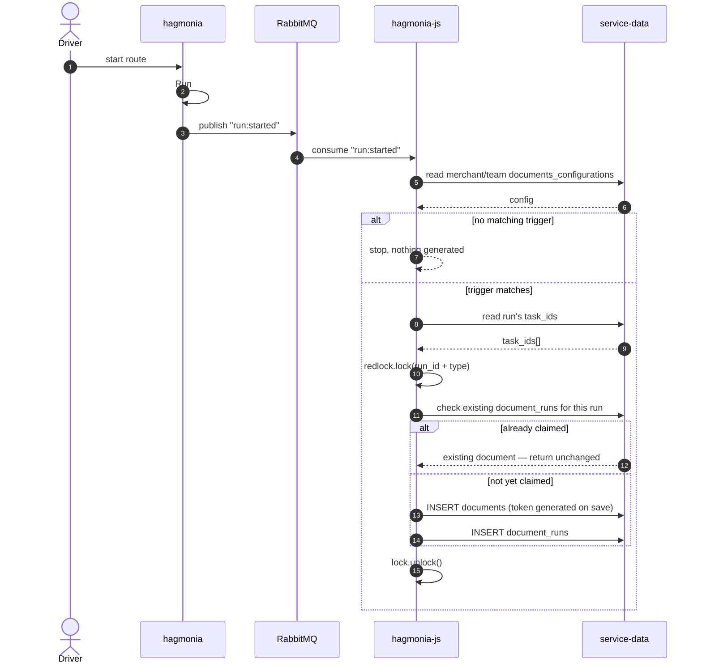
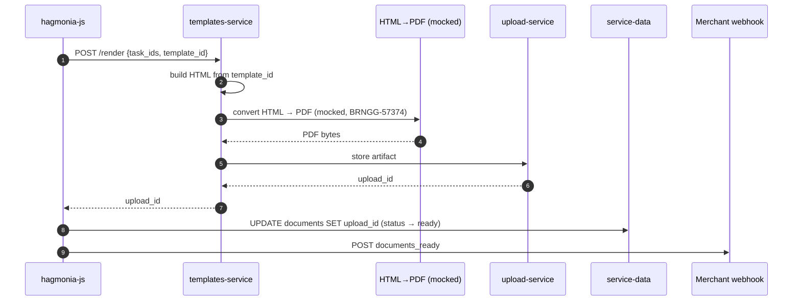
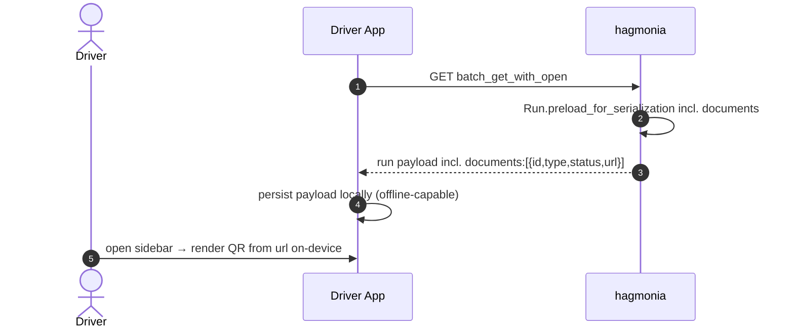
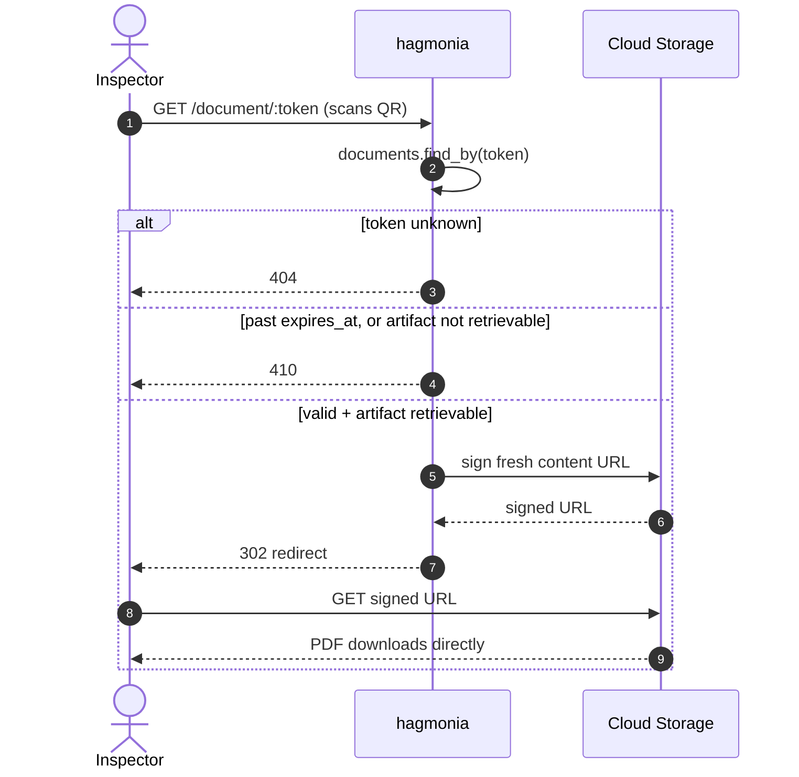
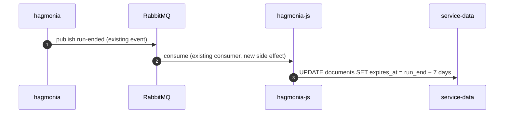

# Sequence diagrams — split by phase

Five diagrams instead of one, matching the phase blocks in the doc's ASCII flow (§3): Trigger + Eligibility + Claim, Render + Webhook, Driver Read, Roadside Scan, Retention.

---

## 1. Trigger, Eligibility Gate, Idempotent Claim

---

## 2. Render, Upload, Webhook

---

## 3. Driver Read (any time after generation)

---

## 4. Roadside Scan (any time up to expiry)

---

## 5. Retention (run end)

