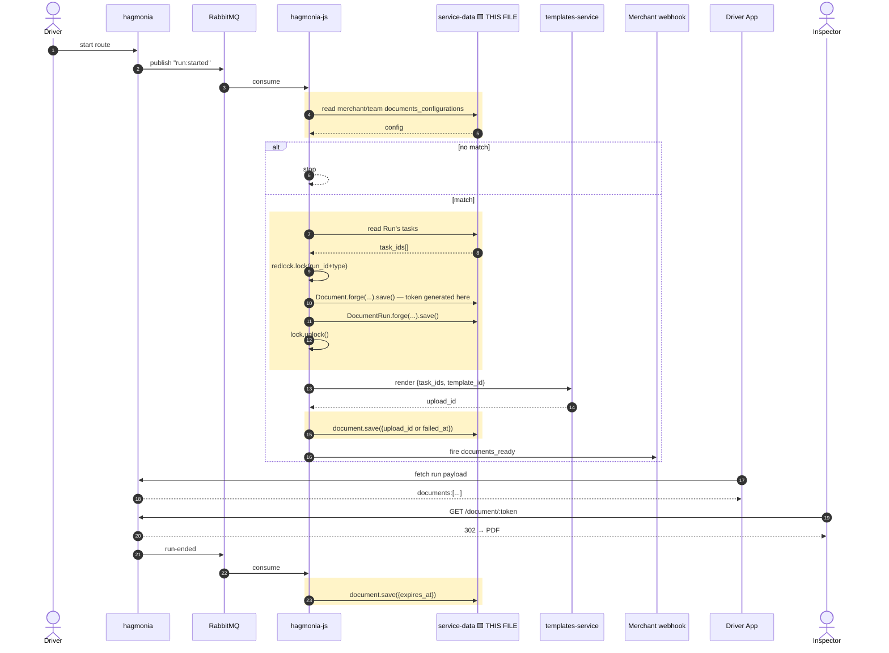

# Phase 1 — service-data — pseudo implementation

## Full flow — this file is the highlighted (boxed) lines only



Boxed = every place `Document`/`DocumentRun` get read or written. Everything else is context.

## `src/models/document.ts`
```ts
import * as crypto from 'crypto';
import { instrumentPrototype } from '@bringg/service';
import Lightshelf, { PROTOTYPE_INSTRUMENTED_FUNCTIONS } from '../model';
import DocumentRun from './document_run';

@instrumentPrototype<Document>(PROTOTYPE_INSTRUMENTED_FUNCTIONS)
export default class Document extends Lightshelf.Model<Document> {
  public get tableName() { return 'documents'; }
  public get hasTimestamps() { return true; }

  documentRuns() { return this.hasMany(DocumentRun); }

  public async save(key?: any, val?: any, options?: any) {
    if (this.isNew() && !this.get('token')) {
      this.set('token', crypto.randomBytes(16).toString('base64url'));
    }
    return super.save(key, val, options);
  }

  public get status(): 'pending' | 'ready' | 'failed' {
    if (this.get('failed_at') && !this.get('upload_id')) return 'failed';
    return this.get('upload_id') ? 'ready' : 'pending';
  }
}
```
Model for the `documents` table. Generates its own token on first save (never on update); exposes `status` as a computed property so no consumer ever recomputes it independently.

## `src/models/document_run.ts`
```ts
import { instrumentPrototype } from '@bringg/service';
import Lightshelf, { PROTOTYPE_INSTRUMENTED_FUNCTIONS } from '../model';
import Document from './document';
import Run from './run';

@instrumentPrototype<DocumentRun>(PROTOTYPE_INSTRUMENTED_FUNCTIONS)
export default class DocumentRun extends Lightshelf.Model<DocumentRun> {
  public get tableName() { return 'document_runs'; }
  public get hasTimestamps() { return true; }
  public get softDelete() { return false; }

  document() { return this.belongsTo(Document); }
  run() { return this.belongsTo(Run); }
}
```
Plain join model linking a `Document` to a `Run`. No own logic — existence and the `document`/`run` relations are all it needs.

## `src/index.ts` (additive)
```ts
import Document from './models/document';
import DocumentRun from './models/document_run';
// ...
export { /* existing exports, */ Document, DocumentRun };
```
Registers both new models in the package's public barrel export — without this, hagmonia-js can't `require` them at all.

## `test/models/document.test.ts`
```ts
describe('Document', () => {
  it('generates a token on create', async () => {
    const doc = await Document.forge({ merchant_id: 1, type: 'run_aggregation' }).save();
    expect(doc.get('token')).to.have.length.greaterThan(20);
  });

  it('does not regenerate token on update', async () => {
    const doc = await Document.forge({ merchant_id: 1, type: 'run_aggregation' }).save();
    const token = doc.get('token');
    await doc.save({ upload_id: 42 }, { patch: true });
    expect(doc.get('token')).to.equal(token);
  });

  it('derives status from upload_id/failed_at', async () => {
    const doc = await Document.forge({ merchant_id: 1, type: 'run_aggregation' }).save();
    expect(doc.status).to.equal('pending');
    await doc.save({ upload_id: 42 }, { patch: true });
    expect(doc.status).to.equal('ready');
    await doc.save({ upload_id: null, failed_at: new Date() }, { patch: true });
    expect(doc.status).to.equal('failed');
  });
});
```
Proves the two behaviors that matter most: token is set once and never overwritten, and `status` correctly reflects all three lifecycle states.

## `test/models/document_run.test.ts`
```ts
describe('DocumentRun', () => {
  it('links a document to a run', async () => {
    const document = await Document.forge({ merchant_id: 1, type: 'run_aggregation' }).save();
    const link = await DocumentRun.forge({ document_id: document.id, run_id: 4821 }).save();
    const fetched = await DocumentRun.forge({ id: link.id }).fetch({ withRelated: ['document'] });
    expect(fetched.related('document').id).to.equal(document.id);
  });
});
```
Confirms the join model actually resolves its `document` relation, since this is the only way S4/S2.1 ever traverse from a run to its document.
