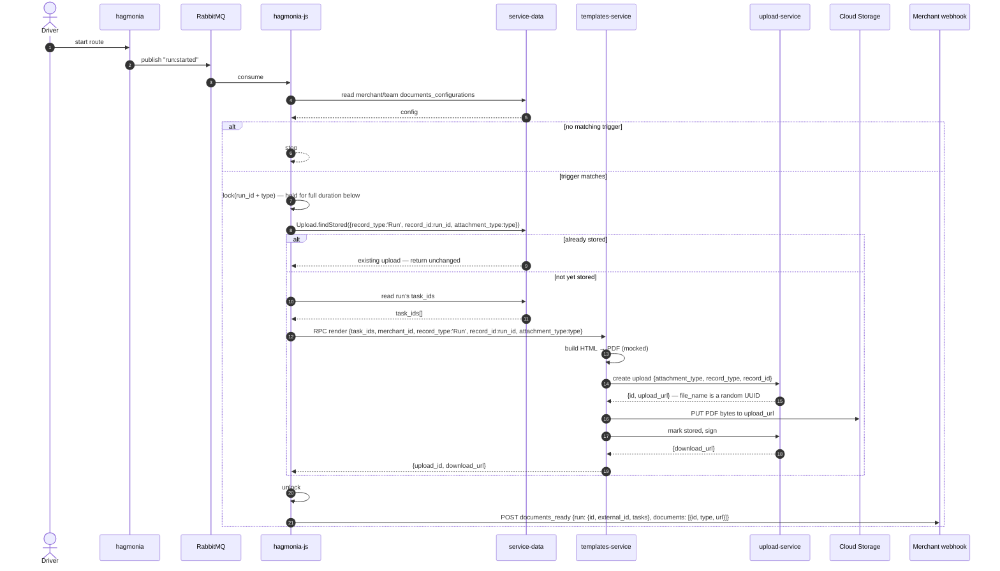
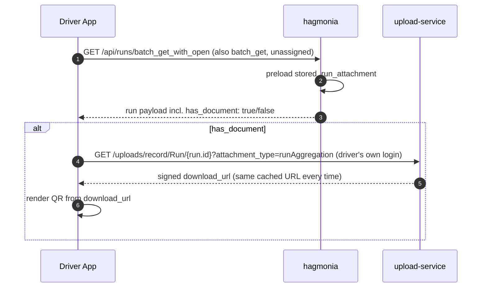
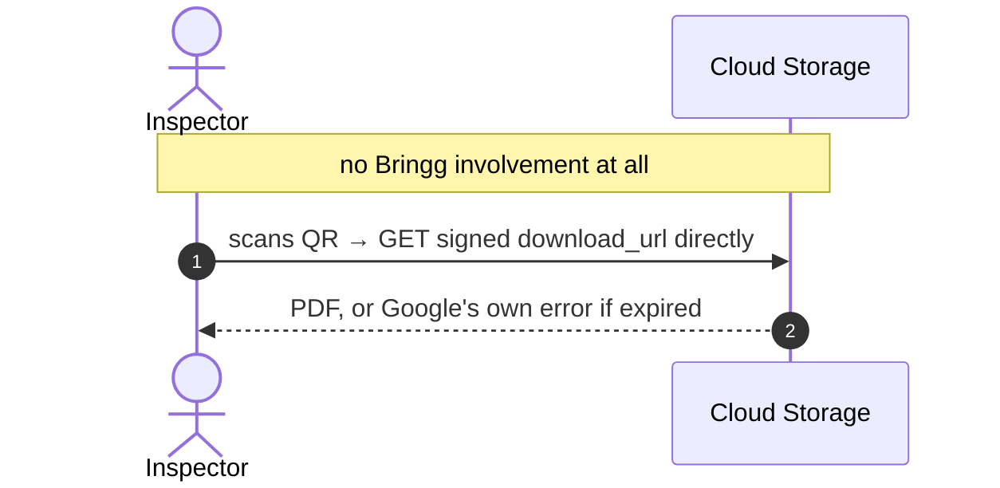

# Driver App QR Code for DeCA Compliance Documents — Technical Design

**Jira:** [BRNGG-55375](https://bringg.atlassian.net/browse/BRNGG-55375) (epic) — [BRNGG-57146](https://bringg.atlassian.net/browse/BRNGG-57146) (S2) · [BRNGG-57148](https://bringg.atlassian.net/browse/BRNGG-57148) (S4) · [BRNGG-57147](https://bringg.atlassian.net/browse/BRNGG-57147) (S3) · [BRNGG-57656](https://bringg.atlassian.net/browse/BRNGG-57656) (S2.1) · [BRNGG-57150](https://bringg.atlassian.net/browse/BRNGG-57150) (S6)
**Author:** Moslem Asaad
**Status:** Draft — Pending Approval

---

## 1. Problem

Spain's Sustainable Mobility Law 9/2025 requires the transport document (DeCA) to be digital and scannable via QR code from **5 October 2026**. Today there is no route-level document and no QR code.

---

## 2. Goal

Create one PDF per route. Let the driver show it as a QR code. Let a roadside inspector scan it and get the file. Let the merchant get notified with a link to the file.

| Consumer | What they get |
| --- | --- |
| **Driver App** | A flag on the run payload saying a document exists, then fetches the file link itself |
| **Roadside inspector** | Scans the QR, goes straight to the file |
| **Merchant (e.g. ADEO)** | A webhook with a link to the file |

---

## 3. High level diagram

Live version (editable): [Miro board](https://miro.com/app/board/uXjVHu3A10o=/?focusWidget=3458764681681040826)

```
Generate a PDF document
Generate a new webhook with the PDF url
Generate a QR code in Driver app linked to the PDF url
Visit the generated url mapped to Google's storage where the document is saved

  ( Driver Starts a run )
            |
     Run Started Event
            v
   +----------------------------------------+
   |              hagmonia-js               |
   | 1. read the run_id                     |
   | 2. get the task ids of the run          |
   |    (via service-data)                  |
   |------------------------------------------|
   | 3. get a download_url and upload_id     |
   |    of the PDF document                  |
   | 4. generate document_ready webhook      |
   +----------------------------------------+
            |          ^
   send task ids       | return upload_id
   via rpc to /render  | and download_url
            v          |
   +----------------------------------------+
   |            template-service             |
   | 1. generate html report                |
   | 2. generate PDF document from the html |
   +----------------------------------------+
            |          ^
   upload the doc      | return upload_id
            v          | and download_url
   +----------------------------------------+
   |              upload-service             |
   | upload the document, returns           |
   | upload_id and download_url             |
   +----------------------------------------+

   +-------------------+   +-------------------------------+
   |    driver app     |   |          inspector            |
   | asks upload-service|  | scans QR, goes straight       |
   | for the link,      |  | to Google storage             |
   | shows QR            |  +-------------------------------+
   +-------------------+
```

---

## 4. Data model

No new tables. The PDF is stored as a normal row in the existing `uploads` table:

```
uploads
  record_type = "Run"
  record_id   = run.id
  attachment_type = "runAggregation"
```

Config shape:

`documents_configurations`, a jsonb column on `MerchantConfiguration`/`TeamConfiguration`:

```json
[
  { "trigger": "run_started", "documents": [{ "type": "runAggregation" }] }
]
```

Team config `null` falls back to the merchant's config; team `[]` explicitly disables, with no fallback.

---

## 5. Dictionary

| Term | Meaning |
| --- | --- |
| `uploads` | Existing shared table used by many features to store any uploaded or generated file. This feature reuses it instead of adding a new table. |
| `record_type` / `record_id` | Columns on `uploads` that say which entity owns the file. For this feature: `record_type = "Run"`, `record_id = run.id`. Same idea already used for task notes (`record_type = "TaskNote"`). |
| `attachment_type` | A column on `uploads` naming the kind of file. This feature uses `"runAggregation"`. |
| `runAggregation` | The one document type this feature builds today: a single PDF covering every task on a run. |
| `findStored` | A method that checks if a file for a given record already exists and is fully uploaded. Used to avoid creating the same document twice. |
| `download_url` | A temporary, signed link straight to the file in cloud storage. Not stored anywhere — asked for fresh each time, valid for up to 7 days. |
| `upload_id` | The id of the row in `uploads` for this file. |
| `has_document` | A true/false flag added to the run payload the Driver App reads, saying whether a document exists for this run. |
| `documents_configurations` | Merchant/team setting that decides if and how a document gets generated for a run. |
| `documents_ready` | The webhook fired once the file is created and stored. |
| `run_attachment` / `stored_run_attachment` | The new links on the `Run` model in hagmonia, added via the existing `has_upload` concern (`has_upload :run_attachment, type: 'runAggregation'`). `run_attachment` matches any upload of that type; `stored_run_attachment` (auto-generated by `has_upload`) is scoped to `stored_at` present — `has_document` uses the latter. |
| Lock | The mechanism (not a database rule) that stops two documents being created for the same run at the same time. |

---

## 6. Sequence diagrams

### 6.1 Trigger, claim, render, webhook



### 6.2 Driver read



### 6.3 Roadside scan



---

## 7. Decisions

### 7.1 Reuse `uploads`, drop `documents`/`document_runs`

An earlier design added two new tables (`documents`, `document_runs`) plus a token column. Dropped — the existing `uploads` table already covers this, using its existing `record_type`/`record_id` link (already used for task notes) instead of a new join table.

### 7.2 No token, no expiry date, no hagmonia endpoint

Dropped the whole idea of a secret token and a hagmonia page that resolves it. Instead:
- The file's storage path already has a random, unguessable name (built in to how uploads are created).
- Whoever needs the file link asks for a signed link with a 7-day expiry, straight from upload-service.
- The inspector never talks to hagmonia at all — the QR points straight at cloud storage.
- If the link is expired, the inspector sees whatever page Google shows for that — not a custom Bringg page. Accepted as-is.

### 7.3 One document per run, enforced by a lock

`run:started` can fire twice (a known race), so hagmonia-js takes a lock, checks if a file already exists, creates one only if not, then releases the lock — held until the file is fully stored, not just until the row is created.

### 7.4 Merchant webhook carries a link straight from the file store

templates-service already gets a working file link back when it marks the upload as stored. hagmonia-js just passes that link into the webhook — no extra step to build a link itself.

### 7.5 Driver App fetches the file itself

hagmonia only tells the Driver App "a document exists" (`has_document: true/false`). The Driver App already has its own login, so it asks upload-service directly for the file link and builds the QR from that. hagmonia never serves the file or the link.

Confirmed: `GET /uploads/record/Run/{run.id}?attachment_type=runAggregation` already exists on upload-service (`SignedUploadsController`, `signed_uploads_controller.ts:211-235`), already reachable by the Driver App's JWT (`@Audience([DRIVER_APP, DASHBOARD_WEB])`, confirmed via that controller's own integration tests). Returns `{..., download_url, ...}`. No `upload_id` needed — `run.id` plus the two fixed constants (`record_type: 'Run'`, `attachment_type: 'runAggregation'`) are enough.

### 7.6 Webhook payload is rooted on `run`, includes task external ids

So the merchant (e.g. ADEO) can match documents back to their own order ids.

```json
{ "run": { "id": 4821, "external_id": "ADEO-RT-4821",
           "tasks": [{ "id": 9001, "external_id": "ADEO-ORD-1001" }] },
  "documents": [{ "id": 1, "type": "runAggregation", "url": "https://..." }] }
```

---

## 8. Changes by layer

### 8.1 hagmonia

Goal: let the driver payload say a document exists, so the app can show the QR.

```ruby
# Run model — reuses the existing has_upload concern rather than a hand-written
# has_one; has_upload auto-generates both `run_attachment` (any upload of this
# type) and `stored_run_attachment` (scoped to stored_at present, added to the
# has_upload concern by hagmonia#12760, "stored upload scope helpers"),
# plus a `stored_run_attachment?` predicate.
has_upload :run_attachment, type: 'runAggregation'
```

```ruby
# Driver::RunSerializer
attributes :has_document
def has_document
  object.stored_run_attachment.present?
end
```

`Run.preload_for_serialization` — add `stored_run_attachment` so this doesn't run one extra query per run.

Nothing else changes in hagmonia. No new controller, no new columns, no new tables.

### 8.2 hagmonia-js

New file `lib/bringg_apps/documents_app.js`:

```ts
class DocumentsApp {
  onRunStarted(message: RunStartedEvent): Promise<void>;
  // checks config, takes the lock, checks findStored, calls templates-service,
  // unlocks, fires the webhook
}
```

Uses the existing `Upload` model from `@bringg/service-data` — no new types needed:

```ts
Upload.findStored(params: {
  merchant_id: number;
  record_type: string;   // 'Run'
  record_id: number;     // run.id
  attachment_type: string;  // 'runAggregation'
}): Promise<Upload | null>;
```

New webhook type `documents_ready`:

```ts
type DocumentsReadyPayload = {
  run: {
    id: number;
    external_id: string;
    tasks: { id: number; external_id: string }[];
  };
  documents: { id: number; type: string; url: string }[];
};
```

The call to templates-service is new (doesn't exist today), but uses the same RPC client already used to call six other services — a small addition, not a new integration.

### 8.3 templates-service

```ts
type RenderPrintOrderRequest = {
  task_ids: number[];
  merchant_id: number;
  record_type?: string;       // new — e.g. 'Run', used when creating the upload
  record_id?: number;         // new — e.g. run.id
  attachment_type?: string;   // new — e.g. 'runAggregation'
};

type RenderPrintOrderResult = {
  upload_id: number;
  download_url?: string;      // new — captured on store, no longer thrown away
};
```

Today `record_type`/`attachment_type` are hardcoded to a fixed value when creating the upload; the new fields, when present, override that.

Today `download_url` is fetched from upload-service on store and thrown away; `render()` must now return it instead.

No `template_id` travels through this request at all — this document reuses the merchant's existing `print_order` template (the epic's own scope: aggregate the existing per-task print-receipt template, not build a new one), resolved the same way the current HTML path already does: `TemplateMerchant.getTemplateByType(merchant_id, TemplateTypeEnum.print_order, ...)`, including the same fallback to the default template on no match. No new enum value, no different behavior from the existing path.

`createNewUpload` must pass the rendered PDF as a `fileBuffer`, not `renderedHtml` — today it uploads the HTML string; the PDF bytes must go to `UploadClient.create` instead.

### 8.4 upload-service

No changes needed — `GET /uploads/record/:record_type/:record_id` (JSON metadata + `download_url`) already exists and is already reachable by the Driver App's audience. See §7.5.

---

## 9. Full change map

| Service | Change |
| --- | --- |
| hagmonia | `run_attachment` association, `has_document` on driver serializer, add to preload |
| hagmonia-js | new `run:started` listener, new RPC call to templates-service, new `documents_ready` webhook |
| templates-service | 3 new optional request fields, stop throwing away the file link, return it |
| upload-service | none |

---

## 10. Testing plan

### hagmonia
- `has_document` is true only once the file is fully stored, not just created.
- No extra query added to the driver payload endpoints.
- Config validator: valid configs pass; malformed entries rejected.

### hagmonia-js
- No config match → nothing happens.
- Two `run:started` events for the same run → only one file gets created.
- templates-service call fails → no file, no webhook, safe to retry later.
- Zero-task run → skipped.
- Team `null` config falls back to merchant's; team `[]` does not fall back.

### templates-service
- New fields correctly set the file's record link and type.
- The returned file link is present and correct.
- Existing callers that don't pass the new fields keep working exactly as before.
- Stores as `application/pdf`, not `text/html`.
- No `print_order` template configured for the merchant falls back to the default template — same behavior as the existing HTML path.

### documents_ready webhook
- Payload shape matches §7.6 exactly — nested `run`/`tasks`/`documents`.
- Delivery boundary: sender called with the exact expected payload/url/merchant_id; no-ops when the merchant has no `documents_ready` subscription.

### End to end
- Driver App sees `has_document: true` only after the file exists.
- Driver App gets a working file link from upload-service using its own login.
- Merchant webhook link works when visited directly.
- Expired link shows the plain storage-provider error page, not a Bringg page — confirmed acceptable.

---

## 11. Known gaps / out of scope

Confirmed-missing Article 6 fields — render blank for now, not blocking this build:
- Vehicle plate (`vehicle.license_plate`) — `Vehicle` is never fetched into the print context today.
- Trailer plate (`Vehicle#trailer`).
- Shipper NIF — no hardcoded fallback found anywhere in templates-service.
- Special-authorization-ID.
