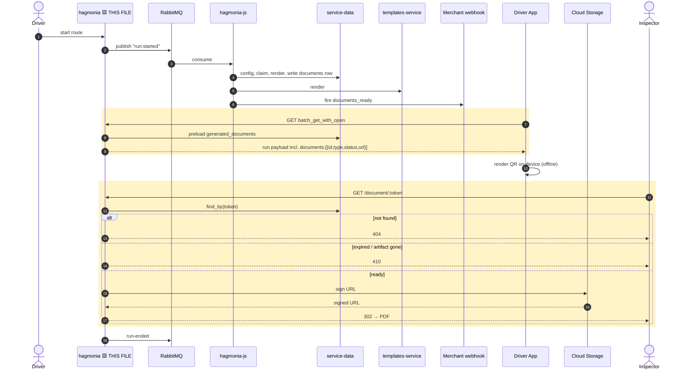

# Phase 2 — hagmonia read side — pseudo implementation

## Full flow — this file is the highlighted (boxed) lines only



Boxed = the driver-payload serializer field and the public `/document/:token` endpoint — the two read surfaces this file adds. Everything upstream of them (generation) is a different file.

## `app/controllers/documents_controller.rb` (new)
```ruby
class DocumentsController < AnonymousController
  def show
    document = GeneratedDocument.find_by(token: params[:token])
    return not_found!(document, "no_such_token") unless document

    return gone!(document, "expired") if document.expires_at&.past?
    return not_found!(document, "not_ready") if document.upload_id.nil?

    upload = Upload.find_by(id: document.upload_id)
    return gone!(document, "artifact_missing") unless upload && artifact_retrievable?(upload)

    url = Storage::UploadStorage.new.generate_content_url(upload)
    log_resolution(document, "redirected")
    redirect_to url, allow_other_host: true, status: :found
  end

  private

  def artifact_retrievable?(upload)
    Storage::CloudStorage.new.file_content_length(upload).present?
  end

  def not_found!(document, outcome)
    log_resolution(document, outcome)
    render plain: "This document could not be found.", status: :not_found
  end

  def gone!(document, outcome)
    log_resolution(document, outcome)
    render plain: "This document link is no longer valid.", status: :gone
  end

  def log_resolution(document, outcome)
    Rails.logger.info(
      message: "document token resolved",
      document_id: document&.id,
      params: { outcome: outcome, token_prefix: params[:token].to_s.first(6) }
    )
  end
end
```
The public, unauthenticated token endpoint. Checks not-found → expired → not-ready → artifact-missing in that order, each with its own logged outcome, before signing and redirecting.

## `config/routes.rb` (additive)
```ruby
get "/document/:token", to: "documents#show"
```
Wires the controller above to `GET /document/:token`, outside any authenticated namespace.

## `app/controllers/api/v2/runs_controller.rb` (additive action)
```ruby
def document
  run = Run.find_by!(id: params[:id], merchant_id: current_user.merchant_id)
  document = run.generated_documents.find_by(type: params[:type])
  return render json: { success: false, message: "not found", rc: 404 }, status: :not_found unless document

  render json: {
    id: document.id,
    type: document.type,
    status: document.status,
    expires_at: document.expires_at
  }
end
```
Authenticated, merchant-scoped lookup — reuses the `find_by!(id:, merchant_id:)` idiom already established elsewhere in this controller, so a mismatched merchant just 404s.
```ruby
# routes.rb
namespace :api do
  namespace :v2 do
    resources :runs do
      member { get :document, path: "document/:type" }
    end
  end
end
```
Nests the new action under the existing authenticated runs routes as `GET /api/v2/runs/:id/document/:type`.

## `app/serializers/driver/run_serializer.rb` (additive attribute)
```ruby
class Driver::RunSerializer < Panko::Serializer
  attributes :id, :uuid, :scheduled_start_time, :scheduled_end_time, :started_at, :ended_at,
             :run_configuration_id, :vehicle_id, :external_id, :is_planned, :end_location, :documents

  has_one :planned_route, serializer: Driver::PlannedRouteSerializer

  def documents
    docs = object.generated_documents
    return Panko::Serializer::SKIP if docs.empty?

    docs.map do |d|
      entry = { id: d.id, type: d.type, status: d.status }
      entry[:url] = document_url(d.token) if d.status == "ready"
      entry
    end
  end

  def document_url(token)
    Rails.application.routes.url_helpers.document_url(token: token, host: Rails.application.config.hagmonia_host)
  end
end
```
Adds `documents` to the driver payload. Uses `Panko::Serializer::SKIP` (not `nil`) so the key is fully absent when there's no document, and `url` is only ever present once `status` is `"ready"`.

## `app/models/run.rb` — `preload_for_serialization` (one-line diff)
```ruby
def self.preload_for_serialization(records)
  records = Array(records).compact
  return if records.empty?

  ActiveRecord::Associations::Preloader.new(
    records: records,
    associations: [:planned_route, :generated_documents]   # was: :planned_route
  ).call
  preload_end_location(records)
end
```
The N+1 guard — adds `generated_documents` to the existing preload call so the new serializer attribute above doesn't issue a query per run.

## `spec/requests/documents_spec.rb` (new)
```ruby
RSpec.describe "GET /document/:token" do
  it "returns 404 for an unknown token" do
    get "/document/does-not-exist"
    expect(response).to have_http_status(:not_found)
  end

  it "returns 410 past expires_at" do
    document = create(:generated_document, expires_at: 1.day.ago, upload_id: create(:upload).id)
    get "/document/#{document.token}"
    expect(response).to have_http_status(:gone)
  end

  it "returns 404 while pending" do
    document = create(:generated_document, upload_id: nil)
    get "/document/#{document.token}"
    expect(response).to have_http_status(:not_found)
  end

  it "302s to a signed URL when ready" do
    upload = create(:upload)
    document = create(:generated_document, upload_id: upload.id)
    get "/document/#{document.token}"
    expect(response).to have_http_status(:found)
  end

  it "never logs the raw token" do
    expect(Rails.logger).to receive(:info) do |payload|
      expect(payload[:params][:token_prefix]).not_to include(full_token)
    end
    get "/document/#{full_token}"
  end
end
```
Covers the four status-code branches plus the one non-negotiable requirement: the full token must never appear in a log line.
