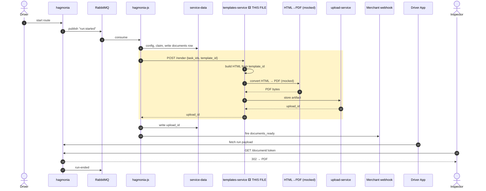

# Phase 4 — templates-service render — pseudo implementation

## Full flow — this file is the highlighted (boxed) lines only



Boxed = the one call this file answers: HTML render → mocked PDF conversion → upload → `upload_id` back. Nothing before or after the box is this file's code.

## `app/helpers/html_to_pdf.ts` (new)
```ts
// TODO(BRNGG-57374): replace with real Gotenberg-backed conversion once that ticket lands.
export async function htmlToPdf(html: string): Promise<Buffer> {
  return Buffer.from(html); // mock: passthrough, not a real PDF
}
```
The one-function mock conversion step — a passthrough stand-in until BRNGG-57374 lands, isolated so swapping it later touches nothing else.

## `node_modules/@bringg/types/types/templates.d.ts` — additive fields
```ts
export type RenderPrintOrderRequest = {
    task_ids: number[];
    merchant_id: number;
    existing_upload_id?: number;
    template_id?: number;   // NEW — presence of this field is the discriminator, no separate `type` field needed
};
```
Adds `template_id` as an optional field. Existing callers never set it, so nothing about today's behavior changes — its mere presence is what the handler branches on.

## `app/services/print_order_handler.ts` — additive branch
```ts
const MAX_DOCUMENT_BYTES = 5 * 1024 * 1024;

async render(event: RenderPrintOrderRequest, logMeta): Promise<RenderPrintOrderResult> {
  const isRunAggregation = Boolean(event.template_id);
  const requestId = event.request_id || uuid();
  const uploadClient = new UploadClient(requestId);

  const compiled = isRunAggregation
    ? await this.getCompiledTemplateById(event.template_id, event.merchant_id)
    : await this.getCompiledTemplate(event.merchant_id, logMeta);

  const html = await this.renderHtml({ ...event, compiled }, logMeta);

  let buffer: Buffer;
  let contentType: string;
  let extension: string;

  if (isRunAggregation) {
    buffer = await htmlToPdf(html);
    if (buffer.byteLength > MAX_DOCUMENT_BYTES) {
      throw new RouteError(StatusCodes.PAYLOAD_TOO_LARGE, 'Rendered document exceeds the 5MB ceiling');
    }
    contentType = 'application/pdf';
    extension = 'pdf';
  } else {
    buffer = Buffer.from(html);
    contentType = 'text/html; charset=utf-8';   // unchanged existing behavior
    extension = PRINT_ORDER_FILE_EXTENSION;      // unchanged existing behavior
  }

  const uploadId = event.existing_upload_id
    ? await this.overrideExistingUpload(uploadClient, event.existing_upload_id, buffer, contentType, logMeta)
    : await this.createNewUpload(uploadClient, event.merchant_id, buffer, contentType, extension, logMeta);
  // run_aggregation never sets existing_upload_id this pass — always createNewUpload

  return { upload_id: uploadId };
}

private async getCompiledTemplateById(templateId: number, merchantId: number) {
  const templateMerchant = await this.templateMerchantRepository.findOneBy(
    { template_id: templateId, merchant_id: merchantId },
    { withRelated: ['template.template_languages'] }
  );
  if (isNil(templateMerchant?.template)) {
    // never fall back to DEFAULT_PRINT_ORDER_TEMPLATE here — a mismatch means a real bug upstream
    throw new RouteNoDataFoundError(Template);
  }
  return Handlebars.compile(templateMerchant.template.content);
}
```
`render` branches on `template_id`'s presence to pick PDF-vs-HTML and enforces the 5MB ceiling before upload; `getCompiledTemplateById` is the new by-ID template lookup, which fails loudly rather than silently falling back to the default template on a mismatch.

## `test/app/services/v1/print_order_handler.test.ts` (additive)
```ts
describe('run_aggregation path', () => {
  it('renders one PDF for N task_ids and returns upload_id', async () => { /* ... */ });
  it('stores as application/pdf, not text/html', async () => { /* ... */ });
  it('throws for a template_id belonging to another merchant', async () => { /* ... */ });
  it('throws for a nonexistent template_id, never falls back to default', async () => { /* ... */ });
  it('rejects output over the 5MB ceiling before upload', async () => { /* ... */ });
  it('always calls uploadClient.create, never .update, for run_aggregation', async () => { /* ... */ });
});

describe('existing print-receipt path — regression guard', () => {
  it('is completely unaffected when template_id is absent', async () => { /* asserts .html / text/html, unchanged */ });
});
```
Two groups: the new `run_aggregation` path's own correctness (including the two failure modes that must never silently succeed), and a dedicated regression guard proving the existing print-receipt flow is byte-for-byte unchanged.
