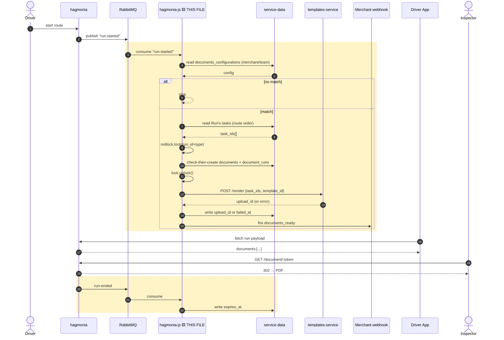

# Phase 3 — hagmonia-js write path — pseudo implementation

## Full flow — this file is the highlighted (boxed) lines only



Boxed = everything this file owns: the trigger, the config gate, the claim, the outbound call, and the run-end hook. Not boxed = what it calls into (`SD`'s own model logic, `Templates`' own rendering, the webhook's own delivery).

## `lib/bringg_apps/documents_app.js` (new)
```js
const Redlock = require('redlock');
const redisClient = require('../../config/redis');
const { Document, DocumentRun, MerchantConfiguration, TeamConfiguration, Task } = require('@bringg/service-data');
const AppSubscriber = require('../../app/events/app_subscriber');
const BaseBringgApp = require('./base_bringg_app');
const { Client: HttpClient } = require('@bringg/service-utils/lib/clients/direct_http/client');
const documentsReadyWebhook = require('../../app/services/webhooks/documents_ready');
const logger = require('../logger');

const redlock = new Redlock([redisClient]);
const LOCK_TTL_MS = 20_000; // covers the templates-service call's own 15s timeout + margin
const TEMPLATES_SERVICE_URL = process.env.TEMPLATES_SERVICE_URL;

class DocumentsApp extends BaseBringgApp {
  async setup() {
    await this.registerQueue(AppSubscriber.REGISTRATION_TYPES.RUN_STARTED, this.onRunStarted);
    await this.registerQueue(AppSubscriber.REGISTRATION_TYPES.RUN_ENDED, this.onRunEnded);
  }

  async onRunStarted(message, logMeta) {
    const { merchant_id: merchantId, run_id: runId, team_id: teamId } = message;

    const config = await this.resolveConfig(merchantId, teamId);
    const matches = (config || []).filter(entry => entry.trigger === 'run_started');
    if (!matches.length) return;

    const taskIds = await this.resolveRunTaskIds(merchantId, runId);
    if (!taskIds.length) {
      logger.info('documents: run has no tasks, skipping generation', { ...logMeta, run_id: runId });
      return;
    }

    for (const entry of matches) {
      for (const doc of entry.documents) {
        await this.generateDocument({
          merchantId, runId, taskIds, type: doc.type, templateId: doc.template_id, logMeta
        });
      }
    }
  }

  async resolveConfig(merchantId, teamId) {
    const merchant = await MerchantConfiguration.forge({ merchant_id: merchantId }).fetch();
    const team = teamId
      ? await TeamConfiguration.forge({ team_id: teamId, merchant_id: merchantId }).fetch()
      : null;
    // team's column is genuinely nullable, no default — this is why ?? is safe here
    return team?.get('documents_configurations') ?? merchant?.get('documents_configurations');
  }

  async resolveRunTaskIds(merchantId, runId) {
    // no existing helper fits — cancelled-task inclusion is an explicit open decision, not resolved here
    const tasks = await Task.query(qb => qb.where({ merchant_id: merchantId, run_id: runId, delete_at: null }))
      .orderBy('priority', 'asc')
      .fetchAll({ columns: ['id'] });
    return tasks.map(t => t.get('id'));
  }

  async generateDocument({ merchantId, runId, taskIds, type, templateId, logMeta }) {
    const lockKey = `documents:${runId}:${type}`;
    const lock = await redlock.lock(lockKey, LOCK_TTL_MS);

    let document;
    try {
      const existingLink = await DocumentRun.query(qb => qb.where({ run_id: runId }))
        .fetch({ withRelated: ['document'] });
      if (existingLink) return existingLink.related('document'); // idempotent — never re-renders, even if failed

      document = await Document.forge({ merchant_id: merchantId, type }).save();
      await DocumentRun.forge({ document_id: document.id, run_id: runId }).save();
    } finally {
      await lock.unlock();
    }

    try {
      const { data } = await new HttpClient().executeRequest(
        {
          method: 'POST',
          url: `${TEMPLATES_SERVICE_URL}/v1/print-order/render`,
          body: { task_ids: taskIds, template_id: templateId, merchant_id: merchantId }
        },
        { timeoutSeconds: 15 }
      );
      await document.save({ upload_id: data.upload_id, failed_at: null }, { patch: true });
    } catch (error) {
      // accepted gap: nothing retries this automatically — see BRNGG-57148 doc
      await document.save({ failed_at: new Date(), failure_reason: error.message }, { patch: true });
      logger.error('documents: generation failed permanently for this run/type, no auto-retry', {
        ...logMeta, document_id: document.id, run_id: runId, error
      });
      return document;
    }

    await documentsReadyWebhook.fire(document, { runId, merchantId }, logMeta);
    return document;
  }

  async onRunEnded(message) {
    const { run_id: runId } = message;
    const links = await DocumentRun.query(qb => qb.where({ run_id: runId }))
      .fetchAll({ withRelated: ['document'] });

    await Promise.all(links.map(link => {
      const expiresAt = new Date(Date.now() + 7 * 24 * 60 * 60 * 1000);
      return link.related('document').save({ expires_at: expiresAt }, { patch: true });
    }));
  }
}

module.exports = DocumentsApp;
```
The whole write path in one class. `onRunStarted` gates on config and skips empty runs; `resolveConfig` is the team-overrides-merchant lookup; `resolveRunTaskIds` gets the run's tasks in route order; `generateDocument` does the Redlock-guarded idempotent claim, calls templates-service with a hard timeout, and writes success/failure back onto the row; `onRunEnded` sets `expires_at` on whatever document exists for that run.

## `test/lib/bringg_apps/documents_app.test.js`
```js
describe('DocumentsApp', () => {
  describe('onRunStarted', () => {
    it('does nothing when no config matches', async () => { /* team + merchant both empty -> no Document created */ });
    it('team overrides merchant', async () => { /* team non-null wins over merchant */ });
    it('team empty array explicitly disables, no fallback', async () => { /* [] !== null */ });
    it('creates exactly one document for two concurrent onRunStarted calls', async () => {
      // simulates the confirmed Rails-side duplicate-publish race, not just a redelivered message
      await Promise.all([app.onRunStarted(message), app.onRunStarted(message)]);
      const count = await DocumentRun.query(qb => qb.where({ run_id: message.run_id })).count();
      expect(count).to.equal(1);
    });
    it('does not re-render a failed document on a second matching trigger', async () => { /* ... */ });
    it('skips generation for a run with zero tasks', async () => { /* ... */ });
    it('sets failed_at without touching upload_id on templates-service error', async () => { /* ... */ });
    it('enforces the timeout — a hanging call still resolves to failed within bounds', async () => { /* ... */ });
  });

  describe('onRunEnded', () => {
    it('sets expires_at only when a document exists for the run', async () => { /* ... */ });
    it('is a no-op for a run with no document', async () => { /* ... */ });
  });
});
```
The two tests worth calling out specifically: the concurrent-call test proves the Redlock claim actually survives the confirmed real race in hagmonia, and the timeout test proves a hung templates-service call can't leave a document stuck forever.
