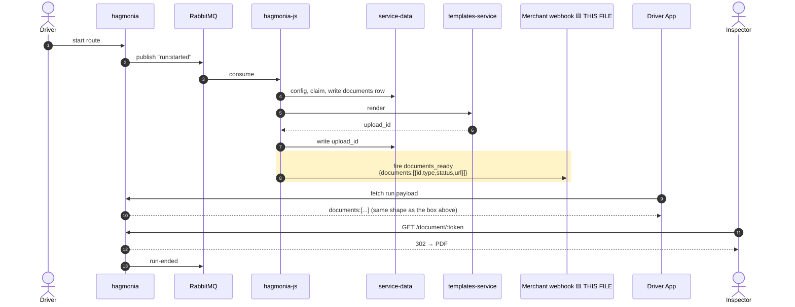

# Phase 5 — documents_ready webhook — pseudo implementation

Payload envelope below uses Option A (run-only) as a placeholder — swap in Option B's `relations` config once Liel/ADEO answer. See the S2.1 doc for both.

## Full flow — this file is the highlighted (boxed) lines only



Boxed = the one outbound call this file builds and sends. Its payload must stay byte-identical in shape to the driver payload line right below it — that's this file's one hard constraint.

## `app/services/webhooks/documents_ready.js` (new)
```js
const BaseWebhook = require('./base_webhook');
const { REGISTRATION_TYPES } = require('../../events/app_subscriber_types');

class DocumentsReady extends BaseWebhook {
  constructor() {
    super({ type: 'documents_ready', title: 'Documents Ready', baseModel: 'run', testable: false });
  }

  setup() {
    this.registerEvent({ eventType: REGISTRATION_TYPES.DOCUMENTS_READY });
  }

  static flexibleModelConfig() {
    return {
      name: 'documents',
      allowedFields: ['id', 'type', 'status', 'url'],
      defaultFields: ['id', 'type', 'status', 'url'],
      allowedRelations: [],
      defaultRelations: []
    };
  }
}

module.exports = DocumentsReady;
```
The webhook type itself — rooted on `run`, exposing `documents` as the one merchant-selectable flexible attribute, following `questionnaire_response_submitted.js`'s pattern rather than `run_ended.js`'s heavy hand-written serializer.

## `app/events/app_subscriber_types.js` (additive)
```js
REGISTRATION_TYPES.DOCUMENTS_READY = 'documents.ready';
```
The internal event-type constant the webhook above registers for and Phase 3 fires.

## `app/services/webhooks/base_webhook.js` — additive `case` in `fetchWebhookData`
```js
case 'documents':
  // passed in directly by the caller (S4), not re-fetched — avoids the read-after-write race,
  // see the S2.1 doc's edge case B
  return message.documents;

case 'run':
  // already exists — Option A config below reaches this unchanged
  return await RunDataService.fetch(
    { merchant_id: message.merchant_id, run_id: message.run_id },
    mergedConfig,
    logMeta
  );
```
The `documents` case reads straight off the message rather than re-fetching by ID (avoids the race); the `run` case is unchanged, shown only to make clear the same existing light path serves both attributes.

## `app/services/webhooks/index.js` (additive)
```js
module.exports = {
  // ...existing ~65 entries
  DocumentsReady: require('./documents_ready')
};
```
Registers the new webhook type in the flat file-per-type registry alongside the ~65 existing ones.

## Firing call — inside `DocumentsApp.generateDocument` (Phase 3), after `upload_id` is set
```js
const { createBackgroundEvent } = require('../../lib/background');
const { REGISTRATION_TYPES } = require('../events/app_subscriber_types');

async function fireDocumentsReady(document, { runId, merchantId }, logMeta) {
  await createBackgroundEvent(REGISTRATION_TYPES.DOCUMENTS_READY, merchantId, {
    merchant_id: merchantId,
    run_id: runId,
    documents: [
      {
        id: document.id,
        type: document.get('type'),
        status: document.status,
        url: `https://${HAGMONIA_HOST}/document/${document.get('token')}`
      }
    ]
  }, logMeta);
}
```
Lives in Phase 3, not this repo section conceptually — the actual trigger call, built from the just-written document object so the webhook never has to re-fetch it.

## `test/services/webhooks/documents_ready.test.js`
```js
describe('DocumentsReady', () => {
  it('payload shape matches S6 driver payload exactly for the same document', () => { /* parity assertion */ });
  it('documents key is absent, not [], when attribute not selected', () => { /* ... */ });
  it('documents key is absent, not [], when entity has no document', () => { /* ... */ });
  it('unknown type values in a consumer are ignored, not an error', () => { /* consumer-side contract test */ });
});

describe('webhook_app delivery boundary', () => {
  it('calls WebhooksService.send with the exact expected payload/url/merchantId', () => {
    sandbox.stub(WebhooksService.prototype, 'send');
    // fire, assert on the stub's call args — this repo's tests never assert past this boundary
  });
  it('no-ops with zero calls when merchant has no documents_ready subscription configured', () => { /* ... */ });
});
```
Two groups: payload-shape correctness (including the absent-not-empty rule), and the delivery boundary — stubbing `WebhooksService.send` is as far as this repo's own tests ever assert, since actual HTTP delivery lives in a separate service.
